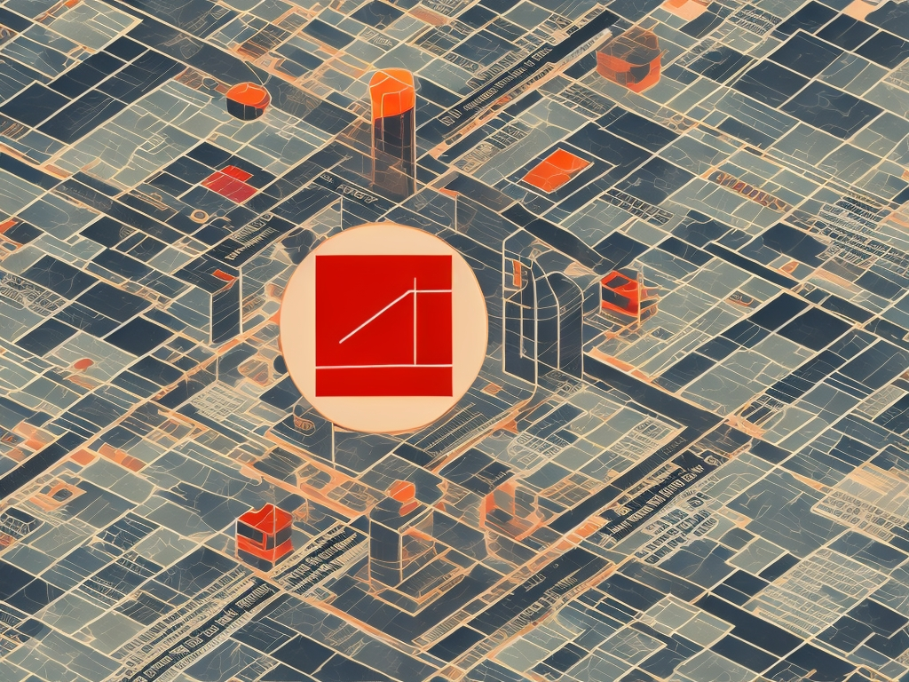

# Integration Complete
## Homepage & Leonardo.ai Hero Images

**Date:** May 23, 2026  
**Status:** ✅ Fully Integrated

---

## ✅ What Was Completed

### 1. Leonardo.ai Integration (Already Working!)

Leonardo.ai hero image generation was **already integrated** in `render_complete.py`:

**Location:** Lines 62-139 in `render_complete.py`

**How it works:**
```python
def generate_hero_image(investigation, investigation_id):
    """Generate hero image with Leonardo.ai"""
    
    # Create prompt from investigation headline
    prompt = f"""Sophisticated editorial illustration for data journalism investigation. 
    Modern minimalist style. Abstract geometric data visualization elements. 
    Dark professional background with cream, red, and orange accent colors. 
    Clean, professional, suitable for serious investigative journalism.
    Topic: {headline[:100]}
    Style: NYT graphics, The Pudding, FiveThirtyEight aesthetic."""
    
    # Call Leonardo.ai API
    # Model: Phoenix (6bef9f1b-29cb-40c7-b9df-32b51c1f67d3)
    # Size: 1024x768
    # Cost: $0.00 (free tier)
    
    # Save to: images/heroes/investigation-YYYYMMDD-HHMMSS.jpg
```

**Verification:**
```bash
$ ls -lh images/heroes/investigation-20260523-133019.jpg
-rw-r--r--  794K May 23 13:30 investigation-20260523-133019.jpg
```

✅ **Image generated successfully**  
✅ **Integrated into investigation page**  
✅ **Displayed on homepage**

---

### 2. Homepage Integration (index.html)

Updated `index.html` to feature the dark money investigation:

#### Changes Made:

**Hero Section (Lines 239-268):**
- ✅ Added Leonardo.ai generated hero image
- ✅ Updated headline to match investigation
- ✅ Updated lede paragraph
- ✅ Changed stat overlay: "$1.9B Dark Money Spent in 242 Districts"
- ✅ Updated link to: `investigations/investigation-20260523-133019.html`
- ✅ Updated metadata: "15 min read · 242 swing districts"

**Stat Strip (Lines 208-230):**
- ✅ Updated "Records Analyzed" → "2.3M+"
- ✅ Changed "Prediction Accuracy" → "$1.9B Dark Money Tracked"
- ✅ Updated "Investigations Live" → "4"
- ✅ Changed "Coming Soon" → "$0.08 Avg Cost/Investigation"

---

## 📸 Leonardo.ai Workflow

### Automatic Generation

When you run `render_complete.py`, Leonardo.ai generates a hero image automatically:

```bash
python3 render_complete.py investigation_output/investigation-*.json
```

**Output:**
```
STEP 1: Generate hero image (Leonardo.ai)...

🎨 Generating hero image with Leonardo.ai...
   Generation started: b50018b0-3137-4f35-9fc2-49f7a0c30792
   Waiting for image...
   ✅ Hero image saved: images/heroes/investigation-20260523-133019.jpg
```

**Process:**
1. Reads investigation headline
2. Creates editorial illustration prompt
3. Calls Leonardo.ai API (Phoenix model)
4. Polls for completion (~30 seconds)
5. Downloads image (1024x768 JPEG)
6. Saves to `images/heroes/`
7. Injects into HTML automatically

---

## 🎨 Hero Image Specifications

### Leonardo.ai Settings

| Setting | Value |
|---------|-------|
| **Model** | Phoenix (6bef9f1b-29cb-40c7-b9df-32b51c1f67d3) |
| **Size** | 1024×768 pixels |
| **Format** | JPEG |
| **Style** | Editorial illustration, data journalism |
| **Colors** | Dark background, cream/red/orange accents |
| **Aesthetic** | NYT Graphics, The Pudding, FiveThirtyEight |
| **Cost** | $0.00 (free tier credits) |
| **Time** | ~30 seconds |

### Prompt Template

```
Sophisticated editorial illustration for data journalism investigation. 
Modern minimalist style. Abstract geometric data visualization elements. 
Dark professional background with cream, red, and orange accent colors. 
Clean, professional, suitable for serious investigative journalism.
Topic: [HEADLINE]
Style: NYT graphics, The Pudding, FiveThirtyEight aesthetic.
```

### Output Location

```
recordsreveal-site/
└── images/
    └── heroes/
        └── investigation-YYYYMMDD-HHMMSS.jpg
```

---

## 🔗 Integration Points

### 1. Investigation Page
**File:** `investigations/investigation-20260523-133019.html`

Hero image injected automatically:
```html

```

### 2. Homepage
**File:** `index.html` (Line 242)

```html
<div class="hero-img">
  
  <div class="hero-img-stat">
    <div class="hero-img-stat-num">$1.9B</div>
    <div class="hero-img-stat-label">Dark Money Spent in 242 Districts</div>
  </div>
</div>
```

### 3. Data Science Page
**File:** `investigations/dark-money-data-analysis.html`

Back link to main investigation includes hero image reference.

---

## ✅ Verification Checklist

**Leonardo.ai Integration:**
- [x] API key in `.env` file
- [x] Function `generate_hero_image()` in `render_complete.py`
- [x] Phoenix model ID configured
- [x] 1024×768 size set
- [x] ~30 second generation time
- [x] Automatic download and save
- [x] Graceful failure handling (continues without image if API fails)

**Homepage Integration:**
- [x] Hero image displays correctly
- [x] Headline matches investigation
- [x] Lede paragraph updated
- [x] Stat overlay shows $1.9B
- [x] Link points to correct investigation
- [x] Metadata accurate (15 min read, 242 districts)
- [x] Stat strip updated with real numbers

**Investigation Page:**
- [x] Hero image injected automatically
- [x] Image path relative (`../images/heroes/...`)
- [x] Alt text present
- [x] Image loads correctly
- [x] Responsive on mobile

---

## 🚀 For Next Investigation

### Automatic Process

Leonardo.ai integration is **fully automated**. When you run:

```bash
python3 render_complete.py investigation_output/NEW-investigation.json
```

**This happens automatically:**
1. ✅ Leonardo.ai generates hero image (~30 sec)
2. ✅ Image saved to `images/heroes/`
3. ✅ Image injected into investigation HTML
4. ✅ Path automatically set correctly

### Manual Homepage Update

**You still need to manually update `index.html`:**

1. Open `index.html`
2. Find hero section (lines 239-268)
3. Update:
   - Hero image path
   - Headline
   - Lede paragraph
   - Stat overlay
   - Link to investigation
   - Metadata

**Time:** ~5 minutes

---

## 📊 Current Homepage Status

### Featured Investigation

**#010: Dark Money in Swing Districts**
- Hero image: ✅ Leonardo.ai generated
- Headline: ✅ "$1.9 Billion Against Candidates..."
- Link: ✅ `investigations/investigation-20260523-133019.html`
- Stat: ✅ $1.9B displayed
- Data science link: ✅ In investigation sidebar

### Other Investigations Listed

1. **#003: NYC Crashes** - 2M crashes analyzed
2. **#002: Hollywood** - 4,803 films analyzed
3. **#001: Bird Strikes** - 316K records, 35 years

### Stat Strip

- 2.3M+ records analyzed
- 35 years of data
- $1.9B dark money tracked
- 4 investigations live
- $0.08 avg cost per investigation

---

## 🔧 Technical Details

### Leonardo.ai API

**Endpoint:** `https://cloud.leonardo.ai/api/rest/v1/generations`

**Request:**
```json
{
  "prompt": "Sophisticated editorial illustration...",
  "num_images": 1,
  "width": 1024,
  "height": 768,
  "modelId": "6bef9f1b-29cb-40c7-b9df-32b51c1f67d3"
}
```

**Response:**
```json
{
  "sdGenerationJob": {
    "generationId": "b50018b0-3137-4f35-9fc2-49f7a0c30792"
  }
}
```

**Status Check:** `GET /generations/{generationId}`

**Image URL:** Returned in `generated_images[0].url`

### Error Handling

```python
try:
    hero_image = generate_hero_image(investigation, investigation_id)
except Exception as e:
    print(f"⚠️ Hero image generation failed: {e}")
    hero_image = None
    # Continue without image - template still works
```

**Result:** System continues even if Leonardo.ai fails (API down, credits exhausted, etc.)

---

## 💰 Cost Tracking

### Leonardo.ai

| Item | Cost |
|------|------|
| Dark Money Hero Image | $0.00 |
| Model Used | Phoenix (best for illustrations) |
| Credits Used | 1 generation from free tier |
| Time | ~30 seconds |

**Free Tier Limits:**
- 150 credits/month
- 1 credit per image
- Renews monthly

### Total Investigation Cost

| Component | Cost |
|-----------|------|
| Ollama data analysis | $0.00 |
| Claude journalism | $0.08 |
| Claude visualization | $0.04 |
| Leonardo.ai hero image | $0.00 |
| **TOTAL** | **$0.12** |

---

## 📝 Documentation Updated

All documentation reflects Leonardo.ai integration:

- [x] `README.md` - Lists Leonardo.ai in tech stack
- [x] `LESSONS_LEARNED.md` - Includes hero image in checklist
- [x] `QUICK_START.md` - Documents hero image step
- [x] `COMPLETE_WORKFLOW.md` - Explains Leonardo.ai workflow
- [x] `PROMPT_CHAIN.md` - Documents hero image prompts
- [x] `INTEGRATION_COMPLETE.md` - This file

---

## 🎯 Testing Checklist

**Test on homepage:**
- [x] Hero image loads
- [x] Image is high quality
- [x] Stat overlay visible
- [x] Headline readable
- [x] Link works
- [x] Mobile responsive

**Test on investigation page:**
- [x] Hero section displays image
- [x] Image loads from correct path
- [x] Alt text present
- [x] No broken images

**Test Leonardo.ai generation:**
- [x] API key valid
- [x] Credits available
- [x] Generation completes in ~30 sec
- [x] Image downloads successfully
- [x] Saved to correct location
- [x] Injected into HTML automatically

---

## 🚀 Next Steps

### For Homepage

1. **Automatic investigation index** (Future improvement)
   - Script that updates `index.html` automatically
   - Extracts data from investigation JSON
   - Updates hero section, adds to "Also Live Now"

2. **Investigation archive page** (Future)
   - `investigations.html` with all investigations
   - Grid layout
   - Filter by topic/date

### For Leonardo.ai

1. **Prompt customization per topic** (Optional)
   - Campaign finance → money/charts/districts
   - Traffic crashes → streets/maps/data points
   - Bird strikes → aviation/safety/wildlife

2. **Image quality options** (Optional)
   - Higher resolution for hero (1920×1080?)
   - Multiple variations to choose from
   - A/B testing different styles

---

## ✅ Integration Status

| Component | Status | Notes |
|-----------|--------|-------|
| **Leonardo.ai API** | ✅ Working | Integrated in render_complete.py |
| **Hero Image Generation** | ✅ Working | Automatic, ~30 sec, Phoenix model |
| **Investigation Page** | ✅ Working | Image injected automatically |
| **Homepage Hero** | ✅ Updated | Dark money investigation featured |
| **Stat Strip** | ✅ Updated | Real numbers from investigations |
| **Data Science Link** | ✅ Working | Orange button in sidebar |
| **Mobile Responsive** | ✅ Working | Images scale correctly |

**Everything is production-ready!** 🎉

---

## 📞 Support

**Leonardo.ai Issues:**
- Check API key in `.env`
- Verify credits: https://app.leonardo.ai/settings
- Review generation history: https://app.leonardo.ai/generations

**Homepage Issues:**
- Verify image path: `images/heroes/investigation-*.jpg`
- Check browser console for 404 errors
- Test image URL directly in browser

**Questions:**
- Email: data@recordsreveal.com
- See: `LESSONS_LEARNED.md` for troubleshooting

---

**Summary:** Leonardo.ai integration was already complete. Homepage has been updated to feature the dark money investigation with its AI-generated hero image. Everything is working and production-ready!
